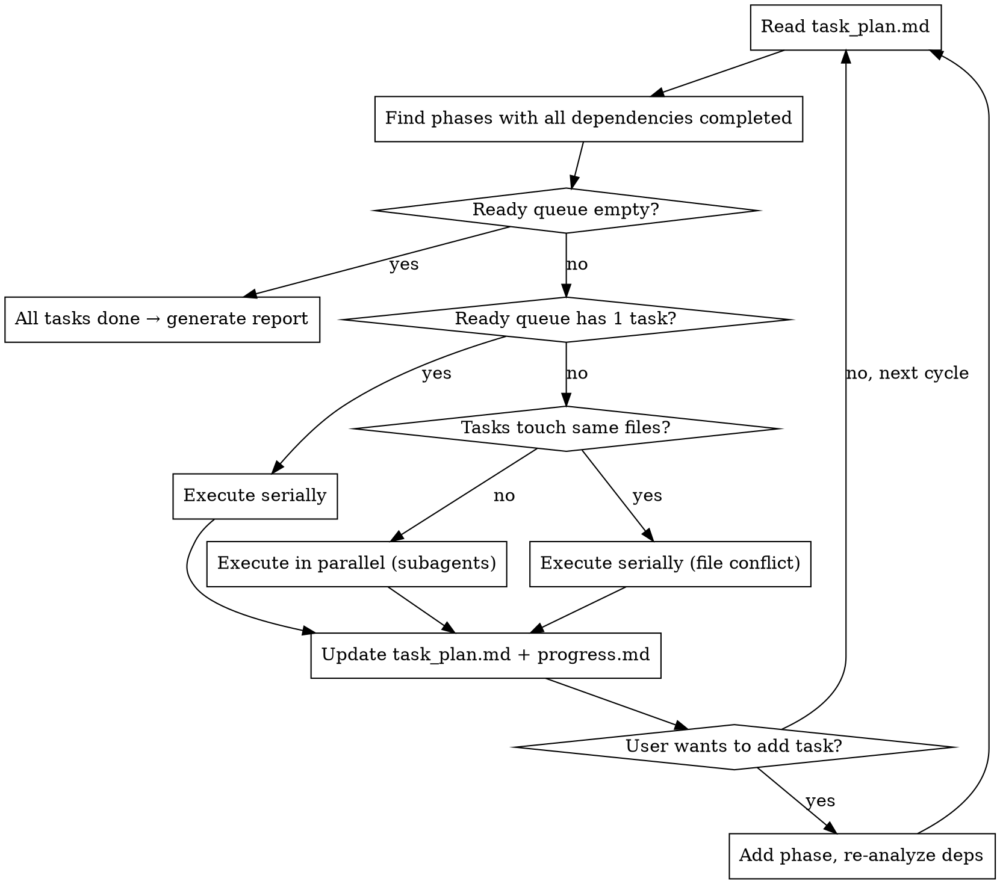

# Autonomous Work Mode

## Overview

Enter autonomous mode when the user signals they're stepping away. Execute tasks using a queue-based scheduler with support for parallel sub-agent execution, timeout handling, and session recovery. Integrates with planning-with-files for task persistence and error handling.

**Core principle:** Task queue + parallel dispatch + checkpoint persistence = resilient autonomous execution.

## Trigger Words

**Enter autonomous mode:**
- "自主工作" / "自己做" / "你自己来"
- "keep going" / "autonomous mode" / "just do it"
- "我去开会/吃饭/忙了" + task description
- "继续之前的任务" / "resume" / "continue" (resumes from checkpoint)
- Any variant meaning "do it yourself, don't wait for me"

**Exit autonomous mode:**
- "暂停" / "停一下" / "等等"
- "pause" / "stop" / "hold on"
- User returns and asks a question (implicit exit)
- On any exit: **clear the statusline indicator** (run the exit command in Status Display section)

## Status Display

When entering autonomous mode, update the claude-hud statusline to show autonomous status. The plugin re-reads config.json every ~300ms, so this is visible immediately in the status bar below the input field.

**Enter autonomous mode — set status:**
```bash
node -e "const fs=require('fs');const p=process.env.HOME+'/.claude/plugins/claude-hud/config.json';const c=JSON.parse(fs.readFileSync(p,'utf8'));c.display=c.display||{};c.display.customLine='🤖 自主模式运行中...';fs.writeFileSync(p,JSON.stringify(c,null,2))"
```

**Exit autonomous mode — clear status:**
```bash
node -e "const fs=require('fs');const p=process.env.HOME+'/.claude/plugins/claude-hud/config.json';const c=JSON.parse(fs.readFileSync(p,'utf8'));if(c.display)delete c.display.customLine;fs.writeFileSync(p,JSON.stringify(c,null,2))"
```

The statusline shows the custom line in orange (color 208) by default, making it clearly visible below the input field.

## Task Queue Structure

Autonomous mode uses planning-with-files for task persistence. Each task maps to a phase in `task_plan.md`.

**REQUIRED SUB-SKILL:** Use `planning-with-files` for file structure, session recovery, and error handling.

### Initialization

When entering autonomous mode:

1. Run `init-session.sh "Autonomous"` to create isolated planning directory:
   ```bash
   ${CLAUDE_SKILL_DIR:-~/.claude/skills/planning-with-files}/scripts/init-session.sh "Autonomous"
   ```
   This creates `.planning/<date>-autonomous/task_plan.md`, `progress.md`, `findings.md`

2. Parse user's task list into phases in `task_plan.md`
3. Each task = one phase with status tracking

### Task Sources

- **Initial batch:** All tasks declared when entering autonomous mode → parsed into phases
- **Dynamic append:** User says "再加一个任务" or similar → add as new phase to `task_plan.md`

### Task Model

Each phase in `task_plan.md` represents a task:

```
### Phase N: [Task Description]
- [ ] [Sub-step if applicable]
- **Status:** pending
- **Dependencies:** [phase IDs, or empty for parallelizable]
- **Retries:** 0
```

## Dependency Resolution

Before execution, Claude analyzes all tasks to determine dependencies.

### Auto-Detection (default)

Claude analyzes tasks and determines:
- **Parallelizable:** Tasks operating on different files/modules → no dependencies
- **Serial:** Tasks with sequential logic (e.g., "write code" then "test code") → dependency set

Rules:
- If task B reads/modifies files that task A creates → B depends on A
- If task B validates task A's output (e.g., "write tests for code A wrote") → B depends on A, even if they touch different files
- If tasks A and B touch completely different files → parallelizable
- If uncertain → default to serial (safer)

### Manual Override

User can override auto-detection:
- "B 依赖 A" / "B depends on A" → set dependency
- "A 和 B 并行" / "A and B in parallel" → remove dependency
- "先做 A 和 B，再做 C" → A+B parallel, C depends on both

### Recording Dependencies

Dependencies are recorded as comments in `task_plan.md`:
```markdown
### Phase 2: Write auth tests
- **Status:** pending
- **Dependencies:** Phase 1
- **Retries:** 0
```

## Queue Scheduling

### Scheduling Cycle

1. Read `task_plan.md` → extract all phases with status
2. Find phases whose dependencies are all `completed` → ready queue
3. If ready queue empty and all phases done → exit loop, generate report
4. If ready queue has 1 task → execute serially
5. If ready queue has multiple tasks:
   - Check file overlap: do any tasks modify the same files?
   - No overlap → dispatch parallel subagents
   - Overlap → execute serially in dependency order
6. After execution → update `task_plan.md` status + log to `progress.md`
7. Loop back to step 1

### Scheduling Flowchart



### Dynamic Task Insertion Behavior

When the user adds a task mid-execution:
1. **Acknowledge immediately:** "收到，已加入队列。" (don't wait for current task to finish)
2. **Don't interrupt in-flight tasks:** Let running tasks/subagents complete
3. **Append to queue:** Add as new phase at the end of `task_plan.md`
4. **Re-analyze dependencies:** Check if new task depends on any existing phases
5. **Resume scheduling:** New task enters the ready queue on the next cycle

## Parallel Execution

When multiple ready tasks operate on different files, dispatch them as parallel subagents.

### Agent Prompt Template (from dispatching-parallel-agents)

Each subagent gets:
- **Specific scope:** One task/phase
- **Clear goal:** Complete the task description
- **Constraints:** Don't modify files outside your scope
- **Expected output:** Summary of what was done, files changed, test results

### Dispatching

```
Agent 1 → Phase 2: "Write auth module tests"
Agent 2 → Phase 3: "Update API documentation"
Agent 3 → Phase 4: "Fix typo in README"
// All three run concurrently
```

### Subagent Status Handling (from subagent-driven-development)

When subagent returns, handle status:

| Status | Action |
|--------|--------|
| DONE | Mark phase `completed` in task_plan.md |
| DONE_WITH_CONCERNS | Read concerns. If about correctness → address before marking complete. If observations → note in progress.md, mark complete |
| NEEDS_CONTEXT | Provide missing context, re-dispatch same task |
| BLOCKED | Assess: context problem → provide more and re-dispatch; task too large → split into sub-phases; plan wrong → escalate to user after autonomous mode ends |

### NEEDS_CONTEXT Retry Limit

If a subagent returns NEEDS_CONTEXT:
1. First, try to resolve the context gap: read relevant files, search the codebase, check findings.md
2. Re-dispatch with the additional context
3. If the subagent returns NEEDS_CONTEXT again on the same task → escalate to BLOCKED
4. Mark the task as `blocked` in `task_plan.md`, note the missing context in `progress.md`
5. Continue with other tasks; report the blocked task in the completion report

**Never** re-dispatch the same task more than twice with NEEDS_CONTEXT. If you can't resolve the context gap, the task is blocked.

### File Conflict Prevention

Before dispatching parallel subagents:
1. List files each task will modify (from task description)
2. If any overlap → serialize those tasks instead
3. If no overlap → safe to parallelize

### Result Merging

After all parallel subagents return:
1. Read each subagent's summary
2. Verify no conflicts (did agents edit same code?)
3. Log results to `progress.md`
4. Update `task_plan.md` phase statuses

## Timeout & Error Handling

### Timeout

- Default per-task timeout: 5 minutes
- On timeout: mark phase as `timeout` in `task_plan.md`, log progress in `progress.md`
- Enter retry cycle (see below)
- After 3 timeouts → mark `failed`, continue with other tasks

### 3-Strike Error Protocol (from planning-with-files)

```
ATTEMPT 1: Diagnose & Fix
  → Read error carefully
  → Identify root cause
  → Apply targeted fix

ATTEMPT 2: Alternative Approach
  → Same error? Try different method
  → NEVER repeat exact same failing action

ATTEMPT 3: Broader Rethink
  → Question assumptions
  → Search for solutions (WebFetch/WebSearch allowed freely)

AFTER 3 FAILURES: Mark phase failed
  → Log in progress.md error table
  → Continue with next task
  → Report in completion report
```

### Error Logging

Every error goes in `progress.md`:

```markdown
### Error Log
| Timestamp | Task | Error | Attempt | Resolution |
|-----------|------|-------|---------|------------|
| 10:35 | Phase 2 | FileNotFoundError | 1 | Added file existence check |
| 10:37 | Phase 2 | JSONDecodeError | 2 | Added empty file handling |
```

### Retry Behavior

- Claude may adjust strategy between retries (following "mutate approach" principle)
- If same error occurs twice → switch approach entirely
- After 3 failures on one task → skip, continue queue, report at end

### Attempt Tracking

To prevent repeating the same failing action, track each attempt in `progress.md`:

```markdown
### Attempt Log
| Task | Attempt | Action | Result | Same as Previous? |
|------|---------|--------|--------|-------------------|
| Phase 2 | 1 | pip install requests | ModuleNotFoundError | — |
| Phase 2 | 2 | pip install requests | ModuleNotFoundError | YES — should try different approach |
```

Before each retry, check the Attempt Log. If the proposed action matches a previous attempt, switch approach.

## Session Recovery

Autonomous mode integrates with planning-with-files for session persistence.

### Checkpoint is Implicit

`task_plan.md` + `progress.md` + `findings.md` ARE the checkpoint. They're updated after every task status change. No separate checkpoint file needed.

### Checkpoint Triggers

Update planning files when:
- Task status changes (started / completed / failed / timeout)
- Before parallel batch launches
- On dynamic task insertion
- Every 10 minutes (check elapsed time before each tool call)

### Manual Resume

User says "继续之前的任务" / "resume" / "continue":
1. Run session-catchup.py to detect unsynced context:
   ```bash
   python3 ${CLAUDE_SKILL_DIR:-~/.claude/skills/planning-with-files}/scripts/session-catchup.py "$(pwd)"
   ```
2. Read `task_plan.md`, `progress.md`, `findings.md`
3. Run `git diff --stat` to see actual code changes
4. Update planning files based on catchup + git diff
5. Re-analyze remaining task dependencies
6. Resume scheduling loop from breakpoint

### Auto-Prompt

On new session startup, if `task_plan.md` exists with incomplete phases:
- Prompt: "检测到未完成的自主任务 (X/Y)。是否继续？"
- If yes → resume flow above
- If no → leave planning files intact, user can resume later

### Session Recovery Checklist

Before resuming:
1. Read all three planning files
2. Run session-catchup.py
3. Run `git diff --stat`
4. Verify which phases are actually complete (code exists) vs marked complete
5. Re-analyze dependencies for remaining tasks
6. Resume scheduling

## Execution Flow

### Step-by-Step

1. **Acknowledge entry** — "进入自主模式，任务：[summary]。完成后汇报。"
2. **Update statusline** — Run the status display command
3. **Init planning files** — Run `init-session.sh "Autonomous"`
4. **Parse tasks** — Write each task as a phase in `task_plan.md`
5. **Analyze dependencies** — Auto-detect or use manual annotations
6. **Schedule & execute** — Run scheduling loop (see Queue Scheduling)
7. **Handle dynamic adds** — User appends task → add phase, re-analyze deps
8. **Generate report** — When all tasks done (or stuck)
9. **Clean up** — Mark all phases complete, clear statusline

## Permission Configuration

Claude Code's permission system may block autonomous execution. Before entering autonomous mode, suggest the user pre-approve common operations:

```json
{
  "permissions": {
    "allow": [
      "Bash(npm test*)",
      "Bash(npm run build*)",
      "Bash(git *)",
      "Bash(python *)",
      "Bash(pip install*)",
      "Read",
      "Edit",
      "Write",
      "WebFetch",
      "WebSearch"
    ]
  }
}
```

Adapt the allowlist to the user's project (e.g., `cargo` for Rust, `go` for Go).

If a permission prompt blocks execution during autonomous mode, include it in your report: "需要你授权 [command] 才能继续。"

## Progress Reporting

When all tasks complete (or you're stuck), report back in this structure:

```
## 自主模式完成报告

### 执行摘要
- 总任务数：N
- 完成：X | 失败：Y | 超时：Z
- 并行批次：P 次（最多同时 N 个 subagent）
- 总耗时：约 M 分钟

### 完成的工作
- [what you did, bullet list]

### 测试结果
- [pass/fail, what was tested]

### 修复的问题（如有）
- [what broke and how you fixed it]

### 失败的任务（如有）
- [which tasks failed and why]

### 需要你确认的事项（如有）
- [open questions, decisions that need human input]

### 下一步建议（可选）
- [what could be done next]
```

## Common Mistakes

| Mistake | Fix |
|---------|-----|
| Every small step asks for confirmation | Chain operations. Only pause for destructive ops. |
| Stuck in infinite fix loop | Use 3-strike protocol. After 3 failures, skip and report. |
| Picks unsafe defaults to "save time" | When uncertain, prefer the safer option. Stop if truly ambiguous. |
| Forgets to report back | Always produce the completion report. User may not be watching. |
| Doesn't suggest permission config | Ask before starting if common ops aren't pre-approved. |
| Forgets to clear statusline on exit | Always clear `customLine` from config.json when leaving autonomous mode. |
| Parallel agents edit same file | Check file overlap before dispatching. Serialize if conflict. |
| Doesn't update planning files | Update task_plan.md + progress.md after every task status change. |
| Skips session-catchup on resume | Always run session-catchup.py before resuming. |
| Ignores subagent NEEDS_CONTEXT status | Provide missing info and re-dispatch, don't skip. |

## Destructive Operations — MUST PAUSE

Even in autonomous mode, **stop and confirm** before:

- **Deleting files or directories** (`rm`, `rmdir`, `del`)
- **Git force push** (`push --force`, `push -f`)
- **Dropping database tables** or truncating data
- **Overwriting uncommitted user work** (e.g., `git checkout -- file` on modified files)

For these, say: "自主模式暂停：即将执行 [operation]，这不可逆。确认继续？"
